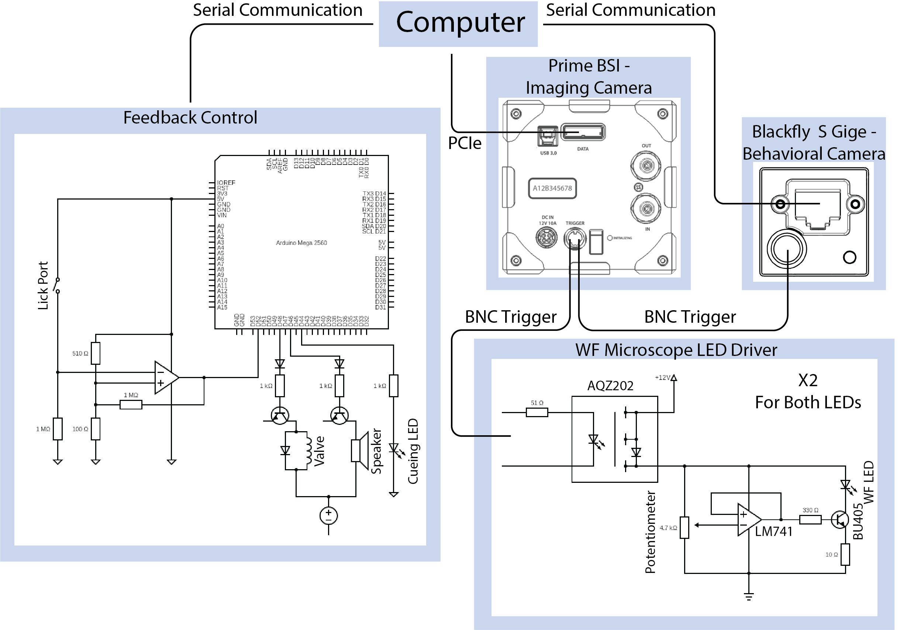

# WideFlow - Real-Time Analysis of Wide-Field Data and Neurofeedback
A python package for neurofeedback closed loop pipeline using a Wide-Field microscope.

## Hardware Requirements:
* Main Microscope Camera - Teledyne Photometrics Prime BSI sCMOS camera
* Behavioral Camera - Teledyne Photometrics Flir Blackfly S GigE
* Neurofeedback Controller - Arduino Mega 2560 

** Using different hardware is possible by implementing device controller objects with the required attributes and methods.

## Software Requirements:
* Tested on Linux Ubuntu 18.04
* Python >= 3.8
* PVCAM - SDK to control the main camera
* SPINNAKER - SDK to control the behavioral camera

## Recommended Supplementary software:
* MicroManager - view main camera stream
* SpinView - view behavioral camera stream

## Installation:
1. Install Python
2. Install the necessary SDKs
3. Clone the repo
4. Install Python packages using the environment.yml file: 
	conda env create -f environment.yml
5. Activate conda environment: 
	conda activate WideFlow

## Usage:
* Make sure all hardware are operating properly
* Create a JSON "Session Configuration File" - checkout bellow for detailed description.
* Run from terminal the main.py file: 
python main.py -c "full path to session configuration file" -s "NeuroFeedbackSession"
* To Analyze the acquired data offline, run the main file with post session pipeline: 
python main.py -c "full path to session configuration file located where all the session data created" -s "PostAnalysisNeuroFeedbackSession"

## Highlights:
The pipline is composed of three main hierarchical abstraction:
* session pipeline - 
	* Handles the session configuration
	* Hardware initialization and termination
	* Feedback control and monitoring
	* Session main loop
	* Subprocesses initialization, termination and queing
* Processing pipeline - 
	* grabbing frames
	* handles and initialize image processing stages
* Processes - 
	* actual image processing
	* metric evaluation
  
* Wide-Filed data is handled and saved using a subprocess and numpy memory map. 
The data is saved in dat format which later can be converted to tiff format.
* Visualization such as dff images, behavioral monitoring and metric bar can be initialize as subprocesses.
* Each iteration the computer communicates with the Arduino to monitor licking occurrence and output a reward if needed.

## Configuration File Format:
The configuration file specify all the acquisition parameters and hardware configurations used during the session.
A template JSON file can be found at:
./wideflow/Imaging/imaging_configurations/imaging_config_template.json

* base_path: string - path to where all sessions data will be saved
* mouse_id: string - mouse unique identification
* session_name: string - session unique identification 
   session data will be saved at base_path/mouse_id/session_name
* camera_config: dictionary - for PVCAM SDK. For more information check PVCAM SDK documentation.
	* core_attr: dictionary - 
		* exp_time: int - exposure time
		* binning: list - [X-axis binning factor, Y-axis binning factor]
		* clear_mode: int - camera sensor clearing mode
	* attr: dictionary
		* channels: int - number of channels for illumination strobbing
		* circ_buffer_count: int - number of frames the camera circular buffer is storing holding in live mode.
		* sensor_roi: list - camera sensor cropping bounds [x0, y0, width, height]
* serial_port_config: dictionary - configure the serial port to communicate with the Arduino. Check PySerial for more information.
	* port_id: string - (Linux OS) path to port file
	* baudrate: int - baudrate of serial port
	* timeout: float - read timeout value in seconds
* behavioral_camera_config: dictionary - for SPINNAKER SDK. For more information check SPINNAKER SDK documentation.
	* activate: bool - determine behavioral camera activation
	* file_name: string - video file name
	* attr: dictionary - 
		* exp_time:int - exposure time
		* roi_bbox: list - define cropping of the image [x0, y0, width, height] 
		* avi_type: string - video file format (e.g "MJPG")
		* acquisition_mode: string - determine operation mode of the camera
		* chosen_trigger: string - camera frame grabbing trigger ("HARDWARE" or "SOFTWARE")
* deep_lab_cut_config: dictionary - 
	* activate: bool - integrate not deep_lab_cut in the analysis
	* model_path: string - path to deep lab cut neural network 
	* model_config: dictionary - 
		* pose_shape: list - shape of model pose numpy array
		* pose_dtype: string - dtype of model pose numpy array
* acquisition_config: dictionary - 
	* vid_file_name: string - name of the acquired Wide Field video
	* meta_file_name: string - name of the output metadata file
	* num_of_frames: int - total number of frames during the session
	* convert_to_tiff: bool - convert the Wide Field video dat file into tiff format at the end of the session.	
* feedbak_config: dictionary - neurofeedback and adaptive threshold configurations
	* inter_feedback_delay: int - minimal time delay (in milli-second) between consecutive rewards
    * update_frames: list - initialization and termination frames to update the adaptive threshold
    * eval_frames: int - number of samples to use when apdating the threshold
    * update_every: int - update threshold once in...
	* metric_threshold: float - initial value for metric_threshold
    * typical_count: int - expected amount of rewards in eval_frames time points (use for "binary_fixed_step_staircase_procedure")
    * count_band: int - margin around typical_count for which threshold doesn't change (use for "binary_fixed_step_staircase_procedure")
    * step: float - value to change threshold in each update step
    * percentile: float - metric distribution percentile for threshold crossing (use for "percentile_update_procedure")
    * nbins: int - number of bins to use for distribution histogram  (use for "percentile_update_procedure")
* supplementary_data_config: dictionary - 
	* rois_dict_path: string - full path to ROIs data hdf5 file
    * mask_path: string - full path to cortex map and mask hdf5 file
* analysis_pipeline_config: dictionary - Wide Data processing pipeline configuration
	* pipeline: string - session object name (session object that follows the abstract_session structure)
	* args: dictionary - session object arguments
		* capacity: int - number of frames to allocate on the gpu for the analysis
		* hemisphere: string - on what hemisphere to perform the analysis("left", "right" or "both")
		* metric_args: arguments for the metric evaluation function
		* regression_n_samples: int - number of samples to use for the hemodynamic regression model
* visualization_config: dictionary - what visualization to use during the session
	* live_stream: dictionary - configuration for live stream of dff data
		* status: bool - activation status
		* size: list - size of image to display
		* dtype: string - type of data
		* buffer: string - buffer var name from which to stream
		* class: string - subprocess object name
		* params: dictionary - kwargs for the class
 

## ROIs Dictionary and Cortical Map:
Supplementary data is saved at ./data
* ./data/cortex_map/allen_2d_cortex.h5 contain a boolean map and mask of the Allen cortical atlas
* ./data/cortex_map/allen_2d_cortex_rois.h5 contain a dictionary of the cortex ROIs with fields:
	* Index - numerical indexing of the ROIs
	* Area - number of pixels belong to ROI
	* Centroid - X, Y coordinates of the ROI center of mass
	* PixelIdcList - flatten indices of the ROI pixels
	* outline - flatten indices of the ROI outline
	* top_left_bottom_right - the top-left and bottom-right pixels of the ROIs
	* name - ROI name

In This work we used both the Allen cortical atlas that parcellates the cortex according to predefined sensory and motor areas, 
and with a functional map generated per mouse using functional parcellation algorithm - Local Selective Spectral Clustering.
Algorithm original article 
[1] - Automated cellular structure extraction in biological images with applications to calcium imaging data 
Adjusment for Wide-Field data 
[2] - Rapid fluctuations in functional connectivity of cortical networks encode spontaneous behavior

## Hardware Circuitry Schematics:
